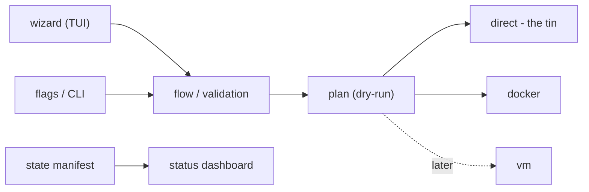

# booooot
> The friendly server provisioner - Keeping things less scary.

<div align="center">

[](README.md)
[](documentation/tasks/README.md)
[](documentation/tasks/)
[](documentation/GOAL.md)

</div>

**booooot** (that's *five* o's) is a command-line wizard for quickly provisioning and installing software on **Debian/Ubuntu** servers. It's built for folks who want a working stack up and running - without wading through docs, package repos, and config files.

booooot asks you what you want in plain language, then does the rest: it can install straight onto the host ("the tin") or into Docker (and later a VM), keeps track of what's installed, shows a colour-coded status dashboard, and knows the common gotchas so you don't have to.

## Table of contents

- [What it will do](#what-it-will-do)
- [How it fits together](#how-it-fits-together)
- [The splash screen](#the-splash-screen)
- [Status & roadmap](#status--roadmap)
- [Implemented so far](#implemented-so-far)
- [Command quick reference](#command-quick-reference)
- [Planned usage preview](#planned-usage-preview)
- [Target requirements](#target-requirements)
- [Repository layout](#repository-layout)

## What it will do

- **Wizard + CLI** - an interactive TUI wizard for the curious, and fast flag-driven commands (`booooot install php --version 8.3 --target docker`) for the scripted.
- **Service catalog** - PHP (multiple versions), MySQL, PostgreSQL, nginx, Node.js + pnpm, Elasticsearch, Varnish.
- **Multiple install targets** - direct to host ("tin"), Docker, and VM (later).
- **Sane defaults, useful configs** - the configuration choices that matter are asked up-front; everything else has a sensible default.
- **Status dashboard** - `booooot status` shows what's installed and running, colour-coded red / amber / green for at-a-glance comprehension.
- **Idempotent** - safe to re-run, never breaks what's already there.
- **Self-diagnosing** - clear error codes, documented fixes, and a `booooot doctor` for common issues.
- **A test platform** - local VM/container + CI so booooot can be tested before it touches a real server.

## How it fits together



## The splash screen

Every run greets you with the ghost and the extruded "booooot" banner, hand-drawn and rendered by `lib/art.sh`:

<details>
<summary><b>Tap to see the banner</b> (plain text - colourised on a real terminal)</summary>

```text
    -▄▓██.▄-
   /▓██████▓|
  |▓██ ▓█ ▓█▓|
  |▓████████▓|
 |░▓████████▓|
 ?▓█▀░▓██▀█▓|
'——'  \▀—'\/'

 ________  ________  ________  ________  ________  ________  _________
|\   __  \|\   __  \|\   __  \|\   __  \|\   __  \|\   __  \|\___   ___\
\ \  \|\ /\ \  \|\  \ \  \|\  \ \  \|\  \ \  \|\  \ \  \|\  \|___ \  \_|
 \ \   __  \ \  \\\  \ \  \\\  \ \  \\\  \ \  \\\  \ \  \\\  \   \ \  \
  \ \  \|\  \ \  \\\  \ \  \\\  \ \  \\\  \ \  \\\  \ \  \\\  \   \ \  \
   \ \_______\ \_______\ \_______\ \_______\ \_______\ \_______\   \ \__\
    \|_______|\|_______|\|_______|\|_______|\|_______|\|_______|    \|__|
```

</details>

## Status & roadmap

**In development - interface layer done.** The wizard, flag-driven CLI, service catalog, dry-run install/uninstall flows, and the colour-coded status dashboard are implemented and safe to run: nothing touches a real system yet. `doctor` is a stub coming in the next task.

| Phase | Focus | Status |
|-------|-------|--------|
| 0 - Foundation | repo layout, branding, output/error framework | done |
| 1 - Interface | CLI + TUI wizard + catalog + dry-run flows | current |
| 2 - Install engine | target abstraction, apt installers, docker, config templates | next |
| 3 - Services | the 7 service modules | planned |
| 4 - Reliability | error docs, idempotency & state manifest, common fixes | planned |
| 5 - Testing platform | bats suite, test VM, CI pipeline | planned |

Details live in [`documentation/GOAL.md`](documentation/GOAL.md) and the task list in [`documentation/tasks/`](documentation/tasks/).

## Implemented so far

- [x] Repo layout & conventions (`001`)
- [x] Branding, ASCII art & colours - `lib/art.sh`, `lib/colors.sh` (`002`)
- [x] Output, logging & error framework - `lib/output.sh`, `lib/errors.sh` (`003`)
- [x] CLI entrypoint & flag parsing (`004`)
- [x] Interactive TUI wizard - whiptail/dialog, back-navigation, ESC quits (`005`)
- [x] Service catalog metadata - `services/` (`006`)
- [x] Install / uninstall dry-run planning - `--plan-file` (`007`)
- [x] Status view & state dashboard - `~/.booooot/state.json` / `--state-file` (`008`)
- [ ] `doctor` command - stub only (`009`)
- [ ] Help & about screens (`010`)

## Command quick reference

| Command | What it does |
|---------|--------------|
| `booooot` / `booooot wizard` | interactive setup wizard (whiptail TUI, Linux) |
| `booooot install <svc> [options]` | plan an install - **dry-run only** (for now) |
| `booooot uninstall <svc> [options]` | plan a removal - **dry-run only** (for now) |
| `booooot status` | colour-coded state dashboard |
| `booooot list` | show the service catalog |
| `booooot doctor` | diagnose & fix common issues *(coming soon)* |
| `booooot help [command]` | per-command help |
| `booooot version` | show version and the ghost |

Global options: `--no-color`, `--log-level`, `--dry-run`, `--yes/-y`, `--no-input`, `--state-file`.

## Planned usage preview

```bash
booooot                    # launch the wizard (same as 'booooot wizard')
booooot list               # what's in the catalog
booooot install php --version 8.3 --target docker --dry-run
booooot status             # colour-coded state dashboard
booooot status --state-file ./dev-state.json   # with a dev/fake manifest
booooot doctor             # diagnose & fix common issues (coming soon)
booooot help install       # per-command help
```

## Target requirements

- Debian / Ubuntu (apt-based)
- bash 4+
- `whiptail` for the interactive TUI wizard (Linux environments)
- Non-interactive / flag mode: pure bash, no extra dependencies - runs in git bash on Windows

## Repository layout

```
booooot/                 # main entrypoint - wizard + flag-driven CLI
├── README.md
├── hero.png             # the booooot ghost (banner/hero art)
├── lib/                 # core modules: colors, output, errors, args, wizard, flow, plan, …
├── services/            # service catalog metadata (php, mysql, nginx, …)
└── documentation/
    ├── GOAL.md          # overarching goal, scope & principles
    └── tasks/           # one file per task, phase by phase
```

Code lands here phase by phase as the plan is completed.

---

<p align="center">
  <sub><b>booooot</b> - five o's, zero fuss · <a href="documentation/GOAL.md">the plan</a> · <a href="documentation/tasks/">task list</a></sub>
</p>
